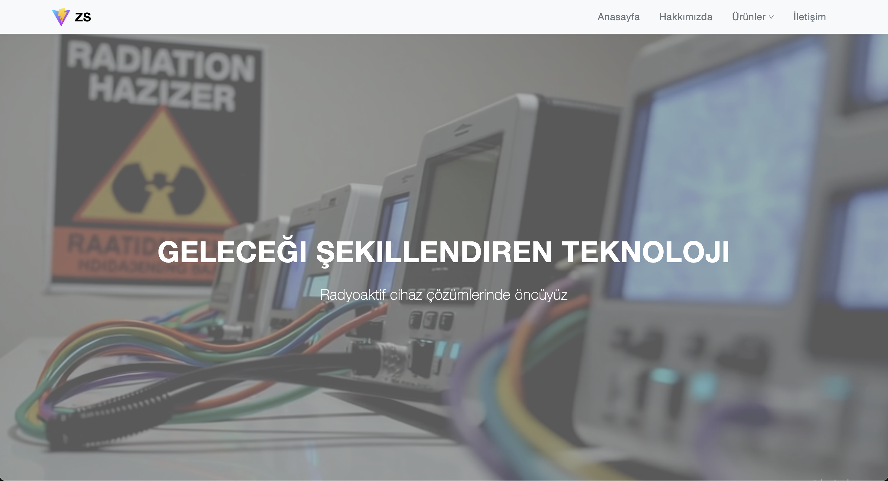
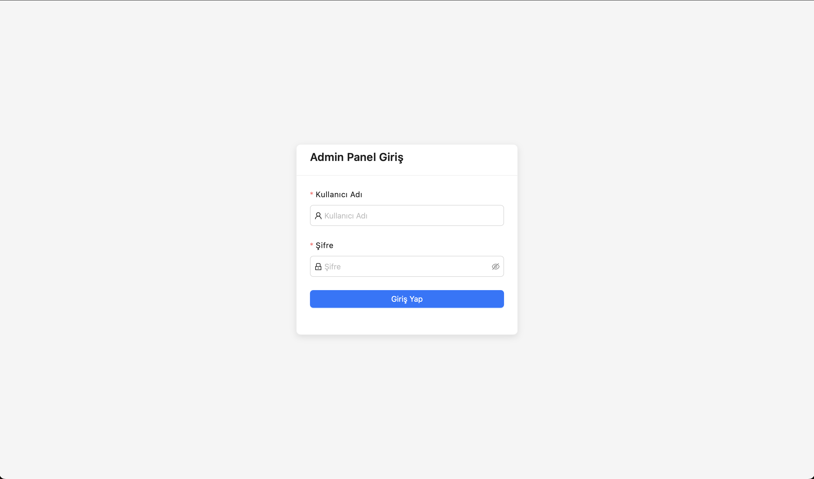
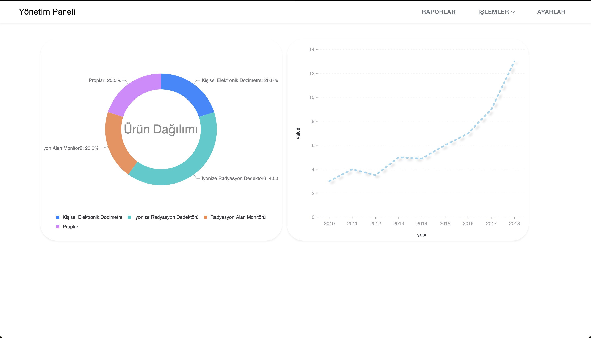
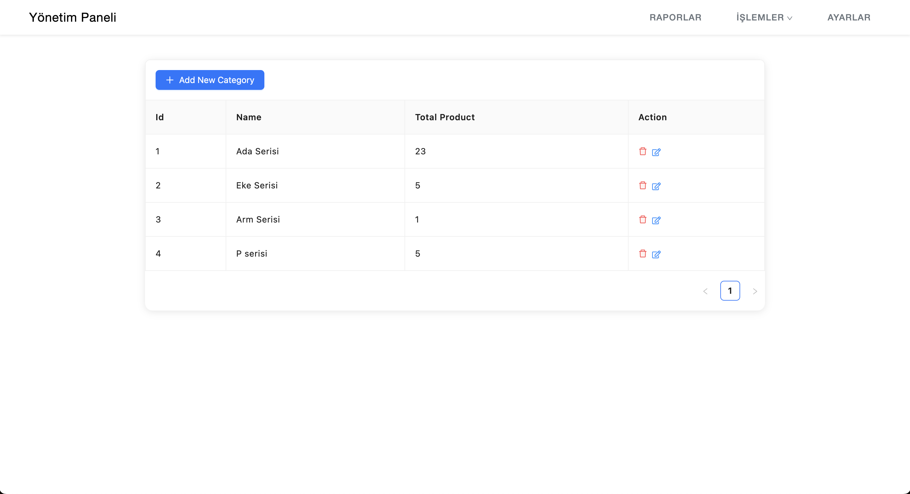

# React + Vite Kurumsal Web Sitesi ve Admin Paneli ⭐️

## Kurulum

- `npm install`
  
## Dosya Yapısı

-  `LoginPage : Kullanıcı giriş işlemleri (test için - username : efe , password : efe123)`
-  `HomePage : Anasayfa`
-  `AdminPage : Yönetim Paneli`
-  `ProductSetting / CategorySetting / UserSetting : CRUD işlemlerin gerçekleştirildiği sayfalar`
-  `Contact : İletişim Formu`
-  `endpoints : Url'lerin tanımlandığı yer`
-  `Services : axios isteklerinin yapıldığı servislerin dosyası`

## Kullanılan Teknoloji ve Kütüphaneler

- `axios`
- `react router`
- `Ant desing - UI Kütüphanesi`
- `Reactstrap - UI kütüphanesi`
- `react icons`
- `bootstrap`
- `Ant desing charts`

